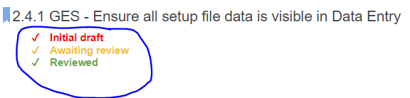
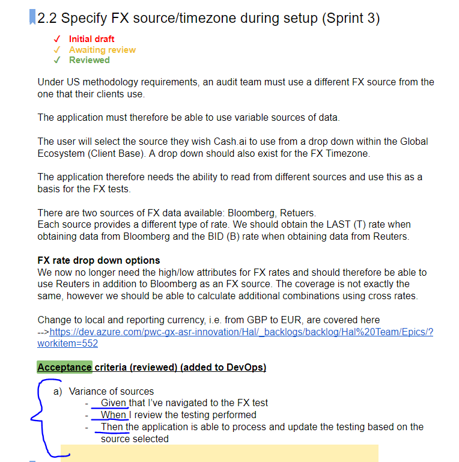

# Agile Ceremonies:
 

 

### Ceremony overview and meeting structure

As well as the descriptions below the following document also breaks down the planning, stand up, review & retrospective meetings across all projects:  [Sprints/ Scrum - Terms of reference](https://docs.google.com/spreadsheets/d/1SaEvFVEJD2xGRav6naKOOgi0JBdRp1Fh2eLvdVtQB6A/edit#gid=0)

 

-------------

 

## Daily  Stand Up:

*The purpose of the daily stand up is to provide concise and clear updates on WI in the sprint.*

The updates should cover three main factors:

1.	What was worked on the prior day 
2.	What you are working on today 
3.	Any blockers you are facing  

 

These updates should be prepared before the call to ensure you are able to clearly update the team on updates and progress.
 
Each team will have one representative to give an update, this will often be the team lead and will collect the team updates prior to the stand up. If this member cannot tend, they should a fellow team member attend in their absence or provide an update before the meeting to the scrum master.
 

**Key points to consider when giving updates are:**
- To ensure that updates are concise, the team lead should refer to the WI ID number so its clear and easy to understand what item is being spoke to
- It is the team members responsibility to move items across the board from ‘New, In Progress, Resolved, Closed’
- Stand Ups are limited to 15 mins total so typically this allows for less than 2 minutes per update
- A few pointers on style and approach:
  - Keep updates brief and pertinent to other team members
  - The aim is to broadcast what was done, what is being worked on next and what blockers (if any) are being faced that you need support with
  - If the information is only useful to a few people on the call then it may be better to take the discussion “offline”

  

### ADO Views and links used in the Daily Stand Up for Updates:

#### Metrics / Dashboard Views:
- https://dev.azure.com/pwc-gx-asr-innovation/Hal/_dashboards/dashboard/b493dfa3-c799-4127-8713-9d936c068544

- https://dev.azure.com/pwc-gx-asr-innovation/Hal/_dashboards/dashboard/f83f6cde-c1a9-4636-b8dd-3e8e9dde0a4f

- https://dev.azure.com/pwc-gx-asr-innovation/Hal/_dashboards/dashboard/03d88c1c-4248-4beb-8fdc-055b24f302c3

- https://dev.azure.com/pwc-gx-asr-innovation/Hal/_dashboards/dashboard/3ac2230c-b736-4e9d-92a8-7d7bdf58ff88

#### ADO Team Board Views:
- https://dev.azure.com/pwc-gx-asr-innovation/Hal/_boards/board/t/Audit.ai%20Programme/Stories/

- https://dev.azure.com/pwc-gx-asr-innovation/Hal/_boards/board/t/H2O.ai%20-%20Backend/Stories?fullScreen=true

- https://dev.azure.com/pwc-gx-asr-innovation/Hal/_boards/board/t/H2O.ai%20-%20Frontend/Stories?fullScreen=true

- https://dev.azure.com/pwc-gx-asr-innovation/Hal/_boards/board/t/Global%20Assurance%20Innovation%20-%20Data/Stories?fullScreen=true

- https://dev.azure.com/pwc-gx-asr-innovation/Hal/_boards/board/t/Data%20Science/Stories

- https://dev.azure.com/pwc-gx-asr-innovation/Hal/_boards/board/t/Global%20Assurance%20Innovation%20-%20Technology/Stories?fullScreen=true

 
 

-------------

 

## Backlog Refinement Meetings:

 

The objective of these meetings are to iteratively and regularly refine the backlog in line with the DEEP backlog standards:

- To help build out the backlog work items as early as possible, creation of new items and iterative development of existing items
- Support backlog prioritisation, with the highest priority items at the top and suitably detailed ready for development
- Moving or removing items that are no longer relevant
- Splitting work items where required  to ensure we have the right structure and work item hierarchy
- Support work item quality so they can be effectively delivered and managed through the process

Ultimately the intention is to coordinate management of work items and development of the backlog in Azure DevOps; this process should also more easily facilitate sprint forecasting and Sprint Planning.

 
 

-------------

 

## Sprint Planning
- On a two weekly basis we run meetings to pick items off the backlog and allocate to upcoming sprints
- Allocation is in line with product priorities (as long as features / requirements are sufficiently detailed to start work on)
- Before a work item is considered for a sprint it should meet the [Definition of Ready](https://dev.azure.com/pwc-gx-asr-innovation/Hal/_wiki/wikis/Hal.wiki/31/Ways-of-Working-(WoW)?anchor=1.-definition-of-ready-(dor))
- Sprint Planning sessions also held across PwC and H20 to introduce the overall 'Sprint Theme" and priorities to be addressed in sprint

 

-------------

 

## Sprint Review (and Retrospective)
- Typically held towards the end of a sprint to reflect on progress made in Sprint
- Demo of product features delivered during sprint
- Opportunity to feedback on lessons learnt, identify improvement opportunities around our ways of working and asses how we improved (or not) since the last demo

 

-------------

 

 

# Processes, Tooling and Artefacts supporting Delivery:

[Audit.ai Deliverable Lifecycle Workflow](https://docs.google.com/drawings/d/1x0Gi8T321o-f0kYKHQqaxH68p9CvNE4rtSJr0YXcb_M/edit?usp=sharing)

 

### 1. Functional Requirements Document
- Used to iteratively define requirements for the Audit.ai product
  - Using collaborative tooling in shared google doc including comments and [suggested edits](https://support.google.com/docs/answer/6033474?co=GENIE.Platform%3DDesktop&hl=en))
- Used to deliver a detailed requirement sufficient enough to build features and user stories in ADO
- Each requirement should have a corresponding acceptance criteria (in line / grouped together with the requirement)
- Requirements Management / Interaction with Azure DevOps (work items):
  - As requirements are developed in the FRD they are also added into Azure DevOps as a placeholder (Epic or Feature level initially) to build the product backlog
  - Once requirements are finalised In the Functional Requirements Document these detailed requirements then feed into the ADO work Item to add sufficient detail for the work item to be estimated and understood by a developer; these details should be made available via a specific link (direct docs bookmark link)
  - Once requirements are defined in the FRD which meet our [Definition of Ready (DoR)](https://dev.azure.com/pwc-gx-asr-innovation/Hal/_wiki/wikis/Hal.wiki/31/Ways-of-Working-(WoW)?anchor=1.-definition-of-ready-(dor)) then the requirements can be "baselined" and the corresponding ADO work item can be picked off the backlog and allocated to a Sprint
  - In the unlikely event that a baselined requirement has to later be changed and work stopped on the corresponding ADO work item for whatever reason then a tag should be added to indicate the work item is "ON HOLD"; this process should only be followed as an exception however
- Managing Change Requests / Changes to "baselined" requirements:
  - "Baselined" in this context means the state of a requirement once it is signed off in the FRD and we are able to fully detail the corresponding ADO work item then
  - If after this stage the requirement needs to change for whatever reason as we learn more then the [Change Request](https://dev.azure.com/pwc-gx-asr-innovation/Hal/_wiki/wikis/Hal.wiki/35/Managing-Bugs-Defects-and-Change-Requests?anchor=managing-change-requests-%2F-changes-to-%22frozen%22-requirements%3A) process is recommended to be followed to ensure transparency and communication
- Documentation Standards to ensure consistency and quality in the FRD's:
  - In the FRDs, we use 3 check boxes against each requirement to capture the current sign-off status to track sign off status:
    
  - In order to obtain sign-off (i.e. tick against Reviewed check box) requirements need to be reviewed with the Programme Sponsors and approval / sign-off confirmed; this then allows the requirement to be consider "Ready" and assigned to a Sprint (or the "ON HOLD" tag removed if it is already allocated to an active sprint).
  - Acceptance Criteria to follow the "Given" --> "When" --> "Then" format:
    

 

### 2. Backlog work items Development in Azure DevOps
- Work items created in ADO are developed from the FRD (as per description above)
- Work items should have hierarchy structure (Epic / Feature / User Story)
- Work items should be prioritised appropriately in the product backlog
- Once they are sufficiently detailed and meet the DoR then they can be allocated to a Sprint (Iteration Path)
- Work Backlog should be developed in line with [DEEP backlog standards](https://dev.azure.com/pwc-gx-asr-innovation/Hal/_wiki/wikis/Hal.wiki/24/Backlog-Management-within-Azure-DevOps?anchor=developing-a-deep-backlog)

 

-------------
