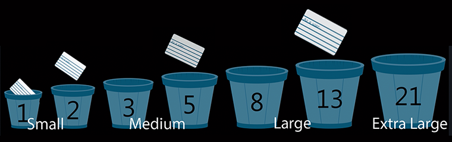

# Agile Estimating
**Information Resources:**
- Personal experience
- Various online resources:
    - [What are story points and how do you estimate them - Atlassian](https://www.atlassian.com/agile/project-management/estimation)
    - [Fibonacci scale (agile) and other estimation scales](https://en.wikipedia.org/wiki/Fibonacci_scale_(agile))
    - [9 AGILE ESTIMATION TECHNIQUES](https://www.berteig.com/how-to-apply-agile/9-agile-estimation-techniques/)
    -  [Agile Fundamentals: Including Scrum and Kanban - 2019](https://www.udemy.com/course/agile-fundamentals-scrum-kanban-scrumban/#instructor-1)
    - [Agile Scrum Mastery: Full Project Simulation + Certification](https://www.udemy.com/course/agile-scrum-mastery/)

## What is estimating?
- Roughly calibrating how long it will take to complete an issue, user story
- Estimation is not a calculation - it’s more closely an "educated guess"
- Using available information to come up with the best guess at how long it will take to get from beginning to done-done
### An educated guess based on:
- Elicited information
- Past experience with a similar type of issue
- Available documentation

### Relative Estimating:
- Looking at issues compared to other issues and not in absolute, time-based, terms
- Sizing based on relativity to the things already estimated
- Only consider issues inside of the project
- Place items that are  alike in buckets rather than detailing out every step

### Why Estimate?
- Provide an estimated duration: move forward, table it, change it
- Drives clarification questions: If you’re going to commit you’ll be forced to thoroughly read the requirements and acceptance criteria
- Highlights complex or high-risk tasks: Bring conversation and mitigate high-risk issues and unrealistic expectations
- Contributes to measuring team velocity: How much can be accomplished within a given sprint?

## Fibonacci Sequence
- Abstract Values to represent the size of a user story
- Each value is the sum of the previous 2 values:  0,1,2,3,5,8,13,21
- There can be alternative Fibonacci-like formats: 0, 0.5, 1, 2, 3, 5, 8, 13, 20, 40, 100

**Summary**
- One of the most commonly used
- Abstract nature can be difficult to initially grasp
- Fibonacci pointing lends itself very well to velocity measurement

### Story Points:
- Using abstract values to represent the relative size of an issue, user story or task
- Each value is the sum of the previous 2 values: 0,1,2,3,5,8,13,21
  Alternative Fibonacci-like sequences are also common, ie: 0, 0.5, 1, 2, 3, 5, 8, 13, 20, 40, 100
- Each user story is compared to other project stories and assigned “Story Points”
- Larger stories should be broken up if possible
- Ideally, no individual task should be more than 16 hours of work
- The number of points completed per sprint is the team's velocity

### Group into buckets:
- Pull together user stories of approximately the same size
- Smallest effort => Largest Effort
- **_The use of numbers is simply a mechanism to name the buckets_**
- Team (or team member) grabs a user story, analyzes and places into an appropriate bucket

### Story Point Range: 1, 2, 3, 5, 8, 13, 21
Though we could agree upon any alternative sequence that suits us

### General classifications and characteristics
To conceptually simplify - though we could certainly adjust the definitions as mutually agreed upon

**`1, 2`: Small**
- Straightforward and simple
- Can definitely be accomplished independently
- `View in terms of hours as opposed to days`

**`3, 5`: Medium**
- "Some" complexity
- Clarity exists and mostly a matter of “doing the work”
- Could require some collaborative effort but mostly can be accomplished independently
- `View in terms of a day to several days - but definitely < week`

**`8, 13`: Large**
- Reasonably complex
- Likely some back and forth collaboration that could stretch out completion time
- Coordination of effort between multiple parties
- Some potential unknowns (you don't know what you don't know)
- _Seriously consider breaking down 13 pointers (if possible)_
- `View in terms of a ~week, week + ` (with high certainty that the story can be completed in a 2-week sprint)

**`21`: Extra large**
- Complex (you should know a 21 when you see it)
- Very likely back and forth collaboration that will stretch out completion time
- Unknown elements
- Dependencies beyond our direct control
- Coordination of effort between multiple parties (especially outside H2O)
- `View in terms of multiple weeks` - there is a very high risk of spillover beyond a 2-week sprint
- _Break Extra Larges down into smaller units_

 

**Notes:**
- Sometimes a big story is simply big (it may not be possible to chunk it down)
- Goal: Chunking down as much as possible (even 8 pointers may be candidates for further breakdown)

 

## Atlassian Online Guide
### Excerpts

**Estimation is hard** 
It must take into account a slew of factors that help product owners make decisions that affect the entire team and the business. 
With all that at stake, it's no wonder everyone from developers to upper management is prone to getting their undies in a bunch about it. 
But that's a mistake. Agile estimation is just that: an estimate. Not a blood-oath.

 

**Collaborating with the product owner** 
Product owners capture requirements from the business, but they don’t always understand the details of implementation. 
So good estimation can give the product owner new insight into the level of effort for each work item,
 which then feeds back into their assessment of each item's relative priority.

 

**Agile estimation is a team sport** 
Each team member brings a different perspective` on the product and the work required to deliver a user story. 
Given the size and distribution of the team it would be difficult to involve everyone - but a worthy objective.

 

**Story points vs. hours** 
Story points rate the relative effort of work in a Fibonacci-like format. 
It may sound counter-intuitive, but that abstraction is actually helpful because it pushes the team to make tougher decisions around the difficulty of work.

**_Here are a few reasons to use story points:_**
- Dates don’t account for the non-project related work that inevitably creeps into our days:
    - emails, slack convos, meetings, pr reviews, interviews, etc. that a team member may be involved in.
- Dates have an emotional attachment to them. Relative estimation removes the emotional attachment.
- Once you agree on the relative effort of each story point value, you can assign points quickly...

 

**Estimate smarter, not harder** 
No individual task should be more than 16 hours of work. 
(If you're using story points, you may decide that, say, 20 points is the upper limit.) 
It’s simply too hard to estimate individual work items larger than that with a high degree of confidence. 
For items deeper in the backlog, give a rough estimate.  
By the time the team actually begins to work on those items, the requirements may change, and your application certainly will have changed.

 

#### Complete Article - well worth a read!
**[What are story points and how do you estimate them - Atlassian](https://www.atlassian.com/agile/project-management/estimation)**
